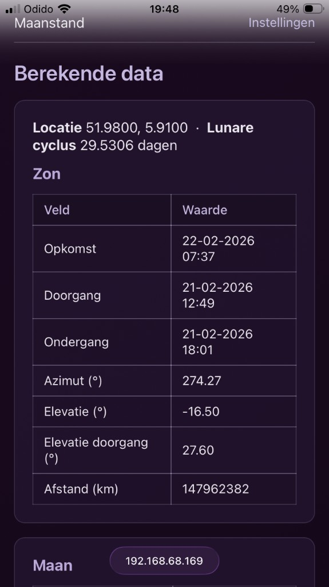
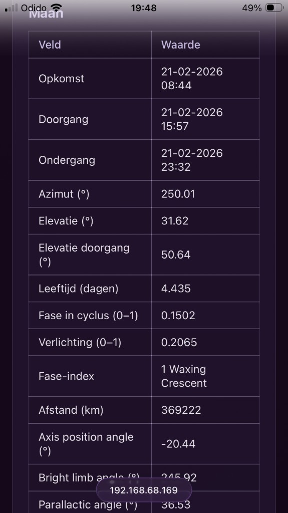
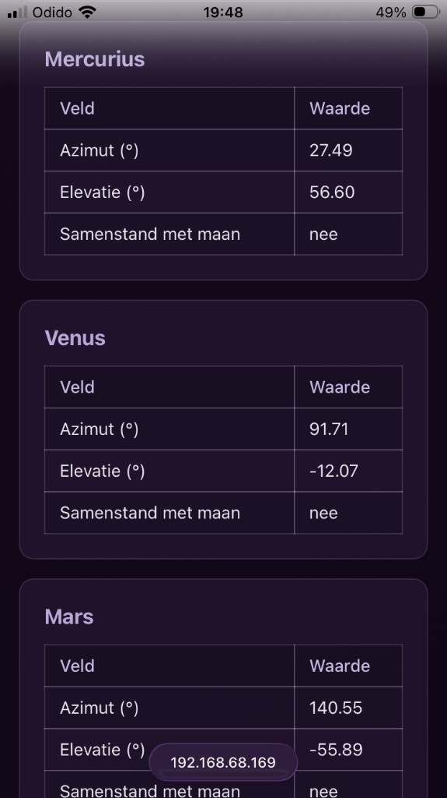
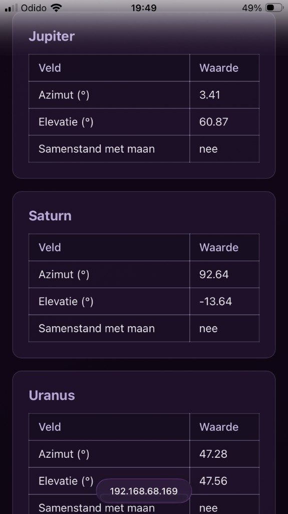
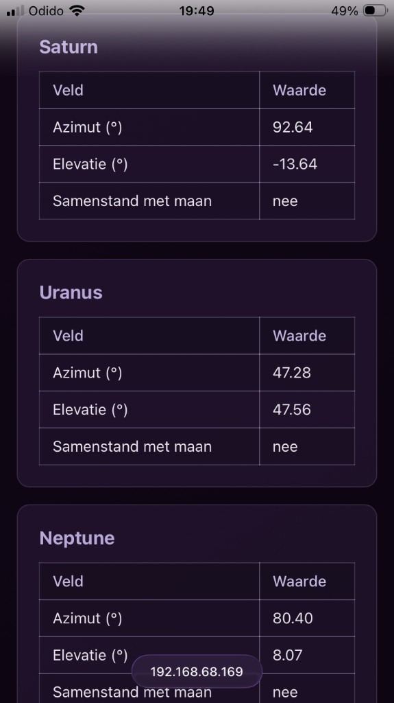
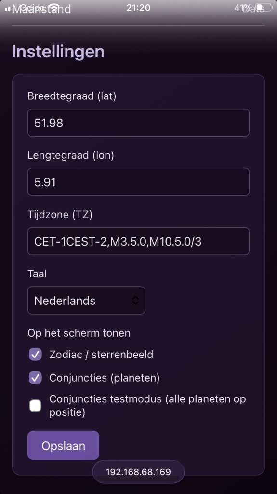

# Maanstand – maanfase-display op ronde TFT

Arduino-sketch voor een **maanfaseklok** op een ronde **GC9A01 TFT (240×240)** met **LVGL**, voor **ESP32-S3 SuperMini**.


## Functies

- Actuele maanfase met realistische sikkel en schaduw
- Wicca-jaarwiel (seizoenen: Imbolc, Ostara, Beltane, enz.) op de bovenste boog
- **Zodiac / sterrenbeeld** – huidig teken rond de maan (afbeeldingen in `zodiac_images.h`), aan/uit via instellingen
- **Planeet-samenstanden** – zeven planeten (Mercurius t/m Neptunus) met iconen (`planet_images.h`); op het scherm en in de web-UI tonen we of een planeet binnen 5° van de maan staat
- NTP-tijd met Nederlandse winter- en zomertijd
- WiFi via **WiFiManager** (captive portal bij eerste start)
- Tekst rond de maan: fase, verlichtingspercentage, datum en tijd (datum en zodiac optioneel via instellingen)
- **Web-interface** – ingebouwde webserver:
  - **Data-pagina** (`/`): locatie, lunare cyclus, tabellen Zon en Maan (opkomst, doorgang, ondergang, azimut, elevatie, afstand, maanfase/verlichting, enz.) en per planeet: positie (azimut/elevatie) en samenstand met maan
  - **Instellingen** (`/settings`): breedtegraad, lengtegraad, tijdzone, **taal (NL/EN)**, en wat op het scherm getoond wordt (datum, zodiac)
- **Taal NL/EN** – alle teksten in de web-UI (titels, labels, tabelkoppen, planeetnamen) en op het display volgen de gekozen taal in Instellingen

## Hardware

- **ESP32-S3 SuperMini**
- **GC9A01** ronde TFT 240×240 (SPI). Pinnen in deze sketch: **3** RST, **4** CS, **5** DC, **6** MOSI, **7** SCK (zie `Setup_GC9A01_S3_SuperMini_NewPins.h`).

*Aansluitingen (achterkant): display via header op de SuperMini, plus eventueel losse draden voor voedings- of signaalpinnen.*


## Web-interface (data-pagina)

De data-pagina (`/`) toont berekende zon-, maan- en planeetgegevens. De waarden worden elke 30 seconden ververst zonder de pagina te herladen.

| Zon: opkomst, doorgang, ondergang, azimut, elevatie, afstand | Maan: opkomst, doorgang, ondergang, fase, verlichting, afstand, hoeken |
|-------------------------------------------------------------|-----------------------------------------------------------------------|
|  |  |

| Planeten: Mercurius, Venus, Mars | Planeten: Jupiter, Saturn, Uranus | Planeten: Saturn, Uranus, Neptunus |
|----------------------------------|-----------------------------------|------------------------------------|
|  |  |  |

### Instellingen

Op `/settings` stel je locatie (breedte-/lengtegraad), tijdzone, taal (Nederlands/English) en schermopties in: zodiac/sterrenbeeld, conjuncties (planeten) en optioneel de conjuncties-testmodus.



## Bibliotheken

- [LVGL](https://github.com/lvgl/lvgl) (lv_conf.h met o.a. `LV_USE_TFT_ESPI`)
- [TFT_eSPI](https://github.com/Bodmer/TFT_eSPI) – gebruik de bij deze sketch meegeleverde configuratie (zie hieronder)
- [WiFiManager](https://github.com/tzapu/WiFiManager) (incl. `FS.h` en `using namespace fs` voor ESP32)
- ESP32 Arduino core (NTP, tijdzone `TZ_NEDERLAND`)

### TFT_eSPI-configuratie installeren

De sketch gebruikt een eigen TFT_eSPI-setup voor **ESP32-S3 SuperMini** en **GC9A01** (pinnen 3=RST, 4=CS, 5=DC, 6=MOSI, 7=SCK). Die moet in de TFT_eSPI-bibliotheek geïnstalleerd worden:

1. **Kopieer het setup-bestand** uit de sketchmap naar de TFT_eSPI-bibliotheek:
   - **Van:** `Maanstand_LVGL/Setup_GC9A01_S3_SuperMini_NewPins.h`  
   - **Naar:** `libraries/TFT_eSPI/User_Setups/Setup_GC9A01_S3_SuperMini_NewPins.h`  
   (De map `libraries` staat in je Arduino-documentenmap of in de map waar je deze sketch hebt staan.)

2. **Activeer deze setup in TFT_eSPI:** open `libraries/TFT_eSPI/User_Setup.h` in de editor, commenteer eventuele andere `#include <User_Setups/...>` regels uit en zorg dat alleen deze regel actief is:
   ```c
   #include <User_Setups/Setup_GC9A01_S3_SuperMini_NewPins.h>
   ```
   Sla het bestand op. Daarna gebruikt TFT_eSPI bij het compileren van deze sketch automatisch de GC9A01- en pinnenconfiguratie voor de SuperMini.

*Als je andere pinnen of een ander board gebruikt,* pas dan `Setup_GC9A01_S3_SuperMini_NewPins.h` (in de sketch of in `User_Setups/`) aan vóór het kopiëren, of maak een eigen setup op basis van dit bestand.

## Bouwen

1. Clone deze repo en open de map in Arduino IDE (of open `Maanstand_LVGL.ino`).
2. Board: **ESP32S3 Dev Module** (of vergelijkbaar voor SuperMini).
3. Installeer LVGL, TFT_eSPI en WiFiManager; **installeer de TFT_eSPI-configuratie** zoals hierboven beschreven.
4. Compileer en upload.

Bij eerste start verschijnt het WiFiManager-AP **Maanstand_WiFi** om je netwerk in te stellen; daarna wordt de tijd via NTP gesynchroniseerd.

Na verbinding start de ingebouwde webserver. Open in je browser het IP-adres van de ESP32 (zie Serial Monitor) voor de **Data**-pagina of `/settings` voor **Instellingen**. Taal en schermopties (datum, zodiac) kun je daar aanpassen; de gekozen taal geldt voor de hele web-UI en het display.
