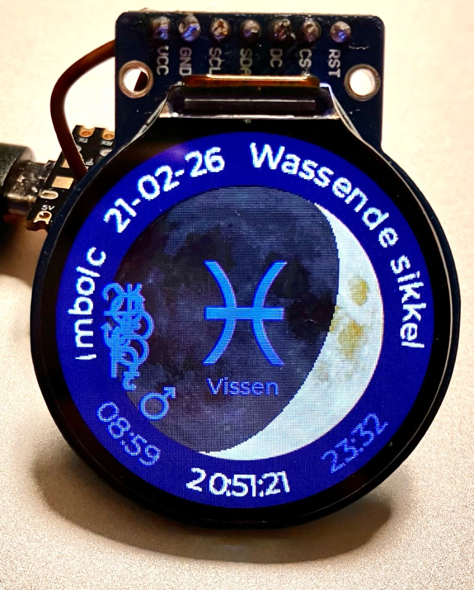
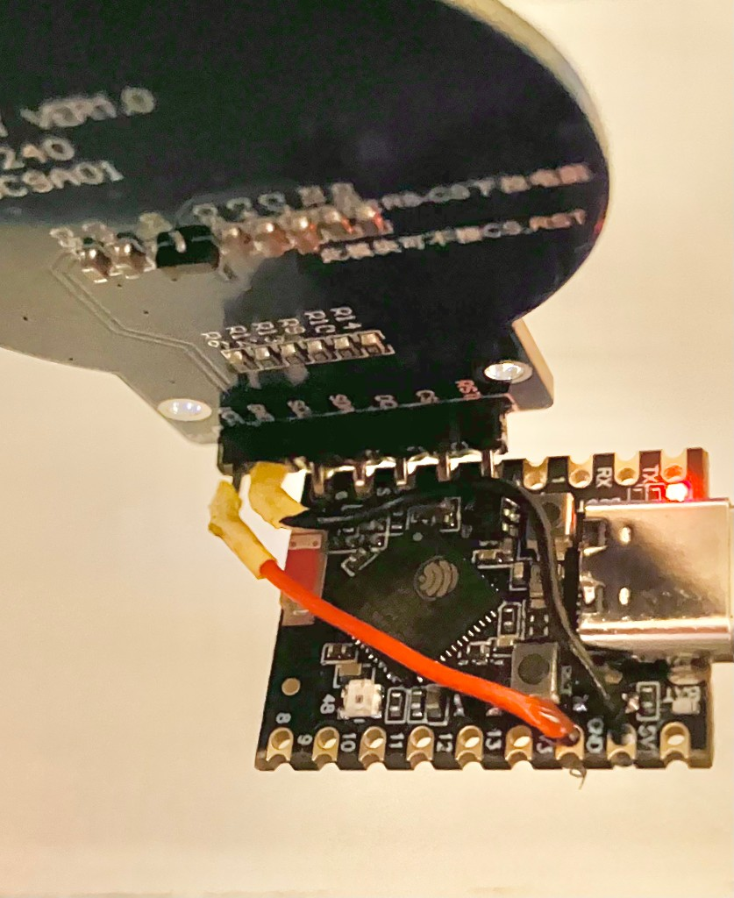

# Maanstand – maanfase-display op ronde TFT

Arduino-sketch voor een **maanfaseklok** op een ronde **GC9A01 TFT (240×240)** met **LVGL**, voor **ESP32-S3 SuperMini**.

## Functies

- Actuele maanfase met realistische sikkel en schaduw
- Wicca-jaarwiel (seizoenen: Imbolc, Ostara, Beltane, enz.) op de bovenste boog
- NTP-tijd met Nederlandse winter- en zomertijd
- WiFi via **WiFiManager** (captive portal bij eerste start)
- Tekst rond de maan: fase, verlichtingspercentage, datum en tijd

## Hardware

- **ESP32-S3 SuperMini**
- **GC9A01** ronde TFT 240×240 (SPI: MISO, MOSI, SCK, CS, DC, RST)
- TFT_eSPI met passende `User_Setup` (o.a. GC9A01, ESP32-S3 pinnen)

*Aansluitingen (achterkant): display via header op de SuperMini, plus eventueel losse draden voor voedings- of signaalpinnen.*

## Bibliotheken

- [LVGL](https://github.com/lvgl/lvgl) (lv_conf.h met o.a. `LV_USE_TFT_ESPI`)
- [TFT_eSPI](https://github.com/Bodmer/TFT_eSPI) met GC9A01-configuratie
- [WiFiManager](https://github.com/tzapu/WiFiManager) (incl. `FS.h` en `using namespace fs` voor ESP32)
- ESP32 Arduino core (NTP, tijdzone `TZ_NEDERLAND`)

## Bouwen

1. Clone deze repo en open de map in Arduino IDE (of open `Maanstand_LVGL.ino`).
2. Board: **ESP32S3 Dev Module** (of vergelijkbaar voor SuperMini).
3. Installeer LVGL, TFT_eSPI en WiFiManager; stel TFT_eSPI in voor GC9A01 en je display-pinnen.
4. Compileer en upload.

Bij eerste start verschijnt het WiFiManager-AP **Maanstand_WiFi** om je netwerk in te stellen; daarna wordt de tijd via NTP gesynchroniseerd.
